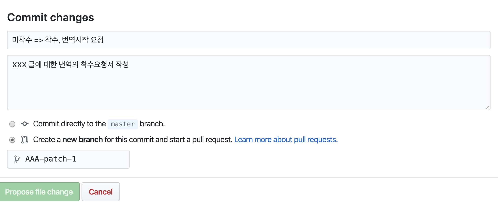

# fast.ai 관련, 영문 글들을 번역하고 관리하기 위한 저장소 입니다.

## 기여 방식

1. README에 나열된 목록에서 "미착수" 상태인것 중 번역을 희망하는 글에 대하여 "착수"로 변경합니다.
   - 웹브라우져상에서 직접적으로 Pull Request를 보내기를 희망하시는 분은 아래 스크린샷 처럼, 우측의 연필모양의 아이콘을 클릭해서 파일내용의 수정이 가능합니다.

2. 1번 항목에서 README 파일의 수정이 완료되면, 아래 스크린샷 처럼 화면 하단에 변경사항을 Commit 하기위한 양식이 있습니다. 여기서, 타이틀 및 코멘트의 작성을 하고, 옵션 버튼의 두 번째를 선택하여 커밋이 새로운 브랜치에서 이뤄지도록 합니다. "Propose file change" 버튼을 클릭합니다.

3.  Pull Request에서 deep-diver 계정 사용자를 반드시 리뷰어로 등록해 주시고, 이후 Pull Request가 수리될 때 까지 리뷰과정을 거치게 됩니다. 

4. 리뷰가 완료되면, 번역해주신 내용이 master 브랜치로 merge되어 등재됩니다. 등재된 글에 대하여 README 파일의 링크 추가 및 상태를 "착수" => "완료"로 변경에 대한 Pull Request도 보내주시기 바랍니다. (만약 이 과정을 생략하면, 일정시간이 지난 후 관리자가 일괄적으로 업데이트할 것입니다)

**기타사항**
- README에 나열되지 않은 글인데, 목록에 포함시키고 싶다 하시는 글이 있으시면 README에 내용을 추가한 후 PR 주시기 바랍니다.
- 마찬가지로, README에 나열되지 않은 카테고리에 대해서도, 필요하다고 생각되는게 있으시면 내용 추가 후 PR 주시기 바랍니다.
- 번역되는 컨텐츠는 Markdown 으로 작성되는 것을 원칙으로 하고, 각 카테고리별 폴더가 존재합니다.
  - 각 폴더에 번역하고자 하시는 글에 대한 Markdown 파일을 작성하셔서 PR 주시기 바랍니다.
  - 본 저장소에 Markdown을 남기는 것을 권장하지만, 개인 블로그에 글을 남기는것을 선호하실 수도 있습니다. 이 경우에는 README 파일의 "번역 링크" 란에, 개인 블로그 주소를 기입해 주시기 바랍니다.

## 목차

- [fast.ai 코스 강의노트](#fastai-course-note)
- [fast.ai가 사용된 프로젝트 소개](#fastai-projects)
- [fast.ai 관련 일반/소식](#fastai-common-news)
- [fast.ai 사용 환경 관련](#fastai-environments)
- [머신러닝/딥러닝 일반](#ml-dl-common)
- [유용한 툴](#useful-tools)
- [기타](#others)

## fast.ai 코스 강의노트 

| 현황   | 원글                                                                                                                             | 번역글 |
| ------ | -------------------------------------------------------------------------------------------------------------------------------- | ------ |
| 미착수 | [Introduction to Random Forest](https://medium.com/@hiromi_suenaga/machine-learning-1-lesson-1-84a1dc2b5236)                     | 미정   |
| 미착수 | [Random Forest Deep Dive](https://medium.com/@hiromi_suenaga/machine-learning-1-lesson-2-d9aebd7dd0b0)                           | 미정   |
| 미착수 | [Performance, Validation, and Model Interpretation](https://medium.com/@hiromi_suenaga/machine-learning-1-lesson-3-fa4065d8cb1e) | 미정   |
| 미착수 | [Feature Importance. Tree Interpreter](https://medium.com/@hiromi_suenaga/machine-learning-1-lesson-4-a536f333b20d)              | 미정   |
| 미착수 | [Extrapolation and RF from Scratch](https://medium.com/@hiromi_suenaga/machine-learning-1-lesson-5-df45f0c99618)                 | 미정   |
| 미착수 | [Data Products and Live Coding](https://medium.com/@hiromi_suenaga/machine-learning-1-lesson-6-14bbb8180d49)                     | 미정   |
| 미착수 | [RF from Scratch and Gradient Descent](https://medium.com/@hiromi_suenaga/machine-learning-1-lesson-7-69c50bc5e9af)              | 미정   |
| 미착수 | [Gradient Descent and Logistic Regression](https://medium.com/@hiromi_suenaga/machine-learning-1-lesson-8-fa1a87064a53)          | 미정   |
| 미착수 | [Regularization, Learning Rates and NLP](https://medium.com/@hiromi_suenaga/machine-learning-1-lesson-9-689bbc828fd2)            | 미정   |
| 미착수 | [More NLP and Columnar Data](https://medium.com/@hiromi_suenaga/machine-learning-1-lesson-10-6ff502b2db45)                       | 미정   |
| 미착수 | [Embeddings](https://medium.com/@hiromi_suenaga/machine-learning-1-lesson-11-7564c3c18bbb)                                       | 미정   |
| 미착수 | [Complete Rossmann, Ethical Issues](https://medium.com/@hiromi_suenaga/machine-learning-1-lesson-12-6c2512e005a3)                | 미정   |
| 미착수 | [new fast.ai course: A Code-First Introduction to Natural Language Processing](https://www.fast.ai/2019/07/08/fastai-nlp/) | 미정  |

## fast.ai가 사용된 프로젝트 소개 
| 현황   | 원글                                                                                                                             | 번역글 |
| ------ | -------------------------------------------------------------------------------------------------------------------------------- | ------ |
| 미착수 | [I Trained a Neural Network on Pet Adoption Photos, and It Was A Little Sad But Mostly Cute.](https://medium.com/@gdoteof/i-trained-a-neural-network-on-pet-adoption-photos-and-this-is-what-happened-21fb78202431) | 미정 |
| 미착수 | [“Microsoft Malware Prediction” and it’s 9 million machines](https://www.linkedin.com/pulse/microsoft-malware-prediction-its-9-million-machines-james-dietle/) | 미정  |
| 미착수 | [(1/2) Fastai, the new radiology tool](https://medium.com/@pierre_guillou/fastai-the-new-radiology-tool-76f02c1e25bf) | 미정  |
| 미착수 | [(2/2) Fastai, the new radiology tool](https://medium.com/@pierre_guillou/2-2-fastai-the-new-radiology-tool-9f0b7db7bf91) | 미정  |
| 미착수 | [How to Quickly Deploy a Computer Vision App](https://towardsdatascience.com/quickly-train-and-deploy-an-ai-computer-vision-app-d34ffa21fdd) | 미정 |

## fast.ai 관련 일반/소식 

| 현황   | 원글                                                                                                                             | 번역글 |
| ------ | -------------------------------------------------------------------------------------------------------------------------------- | ------ |
| **착수** | [High Performance Numeric Programming with Swift: Explorations and Reflections](https://www.fast.ai/2019/01/10/swift-numerics/) | 미정 |
| **완료** | [fast.ai Embracing Swift for Deep Learning](https://www.fast.ai/2019/03/06/fastai-swift/) | [딥러닝에 Swift를 도입하는 fast.ai](https://github.com/fast-ai-kr/ko-translation/blob/master/fastai-common/fastai-swift.md)  |
| 미착수 | [C++11, random distributions, and Swift](https://www.fast.ai/2019/01/13/swift-random/) | 미정  |

## fast.ai 사용 환경 관련 

| 현황   | 원글                                                                                                                             | 번역글 |
| ------ | -------------------------------------------------------------------------------------------------------------------------------- | ------ |
| 미착수 | [Salamander 설정](https://course.fast.ai/start_salamander.html) | 미정 |
| 미착수 | [Salamander 작업재개](https://course.fast.ai/update_salamander.html) | 미정 |
| 미착수 | [Gradient 설정](https://course.fast.ai/start_gradient.html) | 미정 |
| 미착수 | [Gradient 작업재개](https://course.fast.ai/update_gradient.html) | 미정 |
| 미착수 | [Floydhub 설정](https://course.fast.ai/start_floydhub.html) | 미정 |
| 미착수 | [Floydhub 작업재개](https://course.fast.ai/update_floydhub.html) | 미정 |
| 미착수 | [Cretle.ai 설정](https://course.fast.ai/start_crestle.html) | 미정 |
| 미착수 | [Cretle.ai 작업재개](https://course.fast.ai/update_crestle.html) | 미정 |
| **완료** | [Kaggle 설정](https://course.fast.ai/start_kaggle.html) | [Kaggle 설정](./fastai-env/kaggle.md) |
| **완료** | [Kaggle 작업재개](https://course.fast.ai/update_kaggle.html) | [Kaggle 작업재개](./fastai-env/update_kaggle.md) |
| 미착수 | [easyaiforum.cn 설정](https://course.fast.ai/start_easyaiforum.html) | 미정 |
| 미착수 | [easyaiforum.cn 작업재개](https://course.fast.ai/update_easyaiforum.html) | 미정 |
| 미착수 | [GCP 설정](https://course.fast.ai/start_gcp.html) | 미정 |
| 미착수 | [GCP 작업재개](https://course.fast.ai/update_gcp.html) | 미정 |
| 미착수 | [Azure 설정](https://course.fast.ai/start_azure.html) | 미정 |
| 미착수 | [Azure 작업재개](https://course.fast.ai/update_azure.html) | 미정 |
| 미착수 | [Google Colab 설정](https://course.fast.ai/start_colab.html) | 미정 |
| 미착수 | [Google Colab 작업재개](https://course.fast.ai/update_colab.html) | 미정 |
| **완료** | [SageMaker 설정](https://course.fast.ai/start_sagemaker.html) | [SageMaker 설정](./fastai-env/sagemaker.md) | 
| 미착수 | [SageMaker 작업재개](https://course.fast.ai/update_sagemaker.html) | 미정 |
| 미착수 | [SageMaker 배포](https://course.fast.ai/deployment_amzn_sagemaker.html) | 미정 |
| **완료** | [AWS EC2 설정](https://course.fast.ai/start_aws.html) | [AWS EC2 설정](./fastai-env/AWS_EC2_SETUP.md) |
| **완료** | [AWS EC2 작업재개](https://course.fast.ai/update_aws.html) | [AWS EC2 작업재개](./fastai-env/AWS_EC2_ReturnToWork.md) |
| **완료** | [Render 배포](https://course.fast.ai/deployment_render.html) | [Render 배포](./fastai-env/DeployingOnRende.md) |
| 미착수 | [Google App Engine 배포](https://course.fast.ai/deployment_google_app_engine.html) | 미정 | 
| 미착수 | [AWS Lambda 배포](https://course.fast.ai/deployment_aws_lambda.html) | 미정 | 
| 미착수 | [AWS BeanStalk 배포](https://course.fast.ai/deployment_aws_beanstalk.html) | 미정 | 
| 미착수 | [Azure Function 배포](https://course.fast.ai/deployment_azure_functions.html) | 미정 |

## 머신러닝/딥러닝 일반 

| 현황 | 원글                                                                                                                                                                    | 번역글                                                                                                                                                     |
| ---- | ----------------------------------------------------------------------------------------------------------------------------------------------------------------------- | ---------------------------------------------------------------------------------------------------------------------------------------------------------- |
| **완료** | [Understanding Fastai's fit_one_cycle method](https://iconof.com/1cycle-learning-rate-policy/)                                                                          | [Fast.ai의 fit_one_cycle method 이해하기](https://github.com/jehyunlee/texts/blob/master/1cycle-learning-rate-policy/text.md)                              |
| **완료** | [Estimating an Optimal Learning Rate For a Deep Neural Network](https://towardsdatascience.com/estimating-optimal-learning-rate-for-a-deep-neural-network-ce32f2556ce0) | [심층신경망에 맞는 최적 학습률 평가](https://github.com/jehyunlee/texts/blob/master/estimating_an_optimal_learning_rate_for_a_deep_neural_network/text.md) |

## 유용한 툴 

| 현황   | 원글                                                                                                     | 번역글 |
| ------ | -------------------------------------------------------------------------------------------------------- | ------ |
| **완료** | [gi2ds - Google Image Search 2 Dataset](https://github.com/toffebjorkskog/ml-tools/blob/master/gi2ds.md) | [gi2ds - Google Image Search 2 Dataset](https://github.com/fast-ai-kr/ko-translation/blob/master/tools/gi2ds.md)   |
| **완료** | [fastec2: AWS computer management for regular folks](https://www.fast.ai/2019/02/15/fastec2/) | [fastec2: 평범한 사람들을 위한 AWS 컴퓨터 관리](https://github.com/fast-ai-kr/ko-translation/blob/master/tools/fastec2.md)   |
| **완료** | [fastec2 script: Running and monitoring long-running tasks](https://www.fast.ai/2019/02/15/fastec2-script/) | [fastec2 script: 오랫동안-수행되는 작업을 실행하고 모니터링 하는것](https://github.com/fast-ai-kr/ko-translation/blob/master/tools/fastec2-script.md)   |

## 기타 

| 현황   | 원글                                                                                                     | 번역글 |
| ------ | -------------------------------------------------------------------------------------------------------- | ------ |
| 미착수 | [Advice for Better Blog Posts](https://www.fast.ai/2019/05/13/blogging-advice/) | 미정   |
| 미착수 | [What You Need to Know Before Considering a PhD](https://www.fast.ai/2018/08/27/grad-school/) | 미정  |
| 미착수 | [AI Ethics Resources](https://www.fast.ai/2018/09/24/ai-ethics-resources/) | 미정  |
