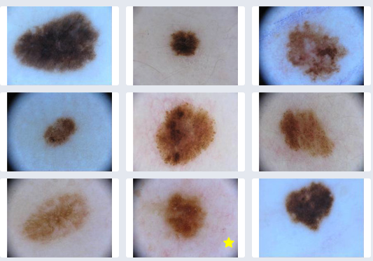
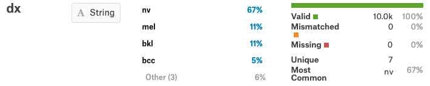
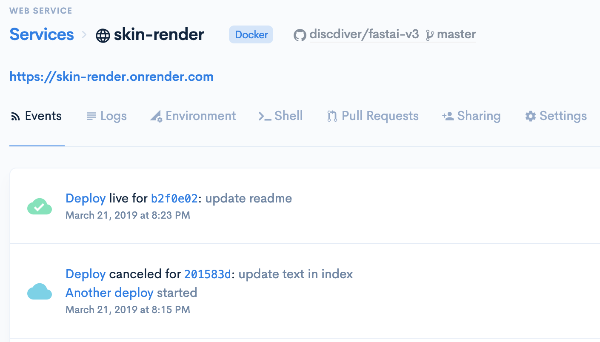
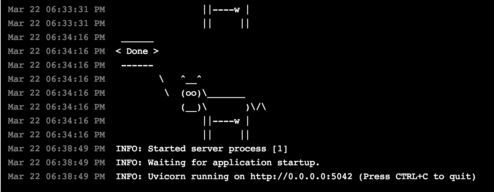
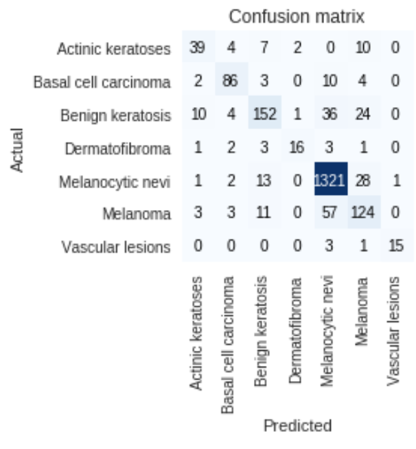

이 글에서는 저는 여러분에게 컴퓨터 비전 분류 모델을 사용하여 개념에서 배포까지 옮겨가는 방법을 소개하려고 합니다. fastai와 함께 여러분은 빠르게 최신 딥러닝 모델을 빌드하고 훈련할 수 있습니다. 그런 다음, Render(*Deployment Platform*)는 앱을 호스팅하고 배포하는 것을 쉽게 만들어줍니다.

우리는 피부병변 영상을 분류할 수 있는 모델을 빌드하고 배포하는 것을 하나하나씩 배워볼 것입니다. 우리가 이를 마쳤을 때 사용자들이 이미지를 업로드할 수 있고, 모델이 그들의 피부병변을 분류할 것입니다.

저는 이와 비슷한 NLP 관련 글도 계획중에 있습니다. 저를 [구독](https://medium.com/@jeffhale)해서 놓치지 말길 바랍니다.


## 고지서

**건강/법률** : 이 프로젝트는 오직 논증을 목적으로 합나다. 여러분이 만약 피부병을 앓고 있다고 생각한다면, 전문적인 피부 치료를 받길 바랍니다. 저는 피부 치료 전문가가 아니니까요.

**기술적인 것** : 이 예제는 백만 단위의 조회수를 기록하는 대규모의 웹사이트를 대상으로 한 것이 아닙니다. 여러분이 이러한 문제를 가지고 있다면, 음, 뭐 좋은 문제라고 할 수 있겠군요.
저는 이 구조가 작동하지 않을거라고 말씀드리는 게 아닙니다. Render는 뒤에서 도커와 쿠버네티스를 이용하여 가능한 성능저하 없이 스케일링을 합니다.

좋습니다. 이제 실전으로 가시죠!


피부암은 암 종류 중에서 가장 흔한 병입니다. 피부 병변을 분류하는 수 많은 앱들이 개발되어 왔습니다. 여러분의 의심스러운 피부 일부를 사진으로 업로드하면 피부과 의사와 상담해야 하는지 알 수 있습니다. 제 생각에는 제 스스로 만들어보기에 좋은 프로젝트라고 생각했습니다.

계획은 이렇습니다.

1. 데이터를 찾는다.
2. 모델을 제작하고 훈련한다.
3. 모델을 배포한다.
4. 모델 성능을 향상시킨다.

이제 이 계획에 살을 붙여보겠습니다.


## 단계

1. 데이터를 찾습니다. 저는 피부 점에 대한 데이터셋을 어디선가 봤던 걸 기억합니다. 아마 UCI나 data.world, Kaggle일겁니다. 검색하고 찾아보겠습니다.

2. 모델을 제작하고 훈련합니다. 저는 현재 fast.ai의 딥러닝 MOOC를 수강하고 있습니다. 그래서 fastai와 고수준의 PyTorch 라이브러리로 제 모델을 학습하는데 사용하도록 할겁니다. fastai는 여러분에게 수 많은 최신 기술과 컴퓨터 비전 업무에서 편리함을 제공하는 API를 적용할 수 있도록 만들어줍니다. 저는 데이터 증강과 전이학습, 학습률 조정을 사용할 예정입니다. 또한 클라우드 상의 GPU를 사용한 쥬피터 노트북으로 훈련하겠습니다.

3. 모델을 배포합니다. fastai의 문서는 [Render](https://render.com/)를 통해 월 5$에 모델을 배포할 수 있는 가이드를 담고 있습니다. 우리는 이를 이용하며 중간중간 설명하도록 하겠습니다.

4. 우리가 모델을 배포한 뒤에, 우리는 이전 단계로 돌아가 모델의 성능을 개선하도록 하겠습니다.

그럼 시작해보겠습니다.


## 데이터 사냥

저는 하버드 연구진들이 모아놓은 10,015장의 피부질환 이미지를 [여기에서](https://dataverse.harvard.edu/dataset.xhtml?persistentId=doi:10.7910/DVN/DBW86T) 찾았습니다.

매년 몇 가지 데이터 양상를 다루는 [ISIC competition](https://www.isic-archive.com/#!/topWithHeader/tightContentTop/challenges)이 있습니다. 다른 필터를 가진 이미지는 [여기에서](https://www.isic-archive.com/#!/topWithHeader/onlyHeaderTop/gallery) 보실 수 있습니다.



저는 피부병변을 분류하기 위해 같은 데이터 셋을 Kaggle에서 찾았습니다. Kaggle notebook에서 한번 확인해보겠습니다. 그러나 하드디스크의 용량과 공유된 도커 컨테이너 메모리의 한계가 우리를 옭아매고 있기 때문에, 우리는 Colab으로 옮겨야 할 것 같습니 두 가지 무과금 선택지에 대한 [제 글](https://towardsdatascience.com/kaggle-vs-colab-faceoff-which-free-gpu-provider-is-tops-d4f0cd625029?source=friends_link&sk=7eb54f51566742d937b8d41adaee1bb9)을 참고하세요.

피부병변 이미지는 두 개의 압축폴더에 압축되어 있습니다. 저는 Kaggle에서 두 개의 데이터셋 압축파일을 하나로 합칠 수 있는 방법을 찾지 못했습니다. 저는 누군가가 데이터를 로드하기 위해 만들어놓은 커스텀 데이터뭉치를 찾았지만, 너무 까다롭고, 이 연습에서는 진행하지 않을 것 입니다.

저는 그냥 데이터를 다운로드받고 압축해서 다시 업로드해야겠다고 생각했습니다. 그러나 데이터를 업로드하는 일은 무지막지하게 시간이 오래 걸렸습니다. 결국 업로드를 해냈고, 여러분은 [여기에서](https://www.kaggle.com/discdiver/mnist1000-with-one-image-folder) 한 폴더로 데이터를 사용할 수 있게 되었습니다.


## 데이터 탐색

HAM10000_metadata.csv라는 메타데이터가 있는 파일이 하나 있습니다. 아주 편리한 녀석입니다. 여기 내용물과 처음의 제 견해를 적어보겠습니다.

lesion_id : 각 병변마다 한 개씩 가지는 id. 각 병변은 둘 이상의 이미지를 가질 수 있습니다.

image_id : 각 병변마다 가지고 있는 이미지의 목록. sans.jpg와 같은 파일이름입니다.

dx : 진단서. 7종류가 있으며 추측컨데 DV(Digital Video)입니다.

dx_type : 진단서가 어떻게 만들어졌는지.

age : 나이. 57개의 값이 누락되어 있습니다. 이를 처리할 때 다른 전략을 시도해볼 수 있습니다.

sex : 성별. 3가지 값이 있습니다.

localization : 몸에서의 위치. 15가지 값이 있습니다.

독특한 사례보다 더 많은 이미지들이 있습니다. 저는 [여기에서](https://www.ncbi.nlm.nih.gov/pmc/articles/PMC6091241/) 같은 이미지가 다른 배율에서 포함되기 때문이라는 것을 알아냈습니다. 이것은 사실상의 데이터 증강입니다.


## 첫 의문점들

결과 변수에 대해 얼마나 많은 분류 라벨이 존재할까요? 7개입니다.(멜라닌세포 모반, 흑색종, 양성 각화증, 기저세포암, 광선 각화증, 혈관병변, 피부섬유종) 흑색종은 피부암 중 가장 위험한 종류라는 것을 알아두시기 바랍니다. 여러분은 또한 기저세포암이 가장 빈번한 피부암 종류라는 것과 광선 각화증이 잠재적인 전암(*역자 주 : 고빈도로 암이 되기 쉬운 상태*)으로 여겨지는 것을 알아둬야 합니다.

어떤 이미지도 한 개 이상의 종류로 분류될 것 같아보이지 않고, 우리는 다분류 문제와 직면했지만, 다중 라벨의 문제는 아닙니다.

이 데이터가 균형이 맞지 않나요? 그렇습니다. 67%가 멜라닌세포 모반을 의미하는 nv 종류입니다.



우리는 불균형한 분류에 대한 보고서 측정지표에 주의할 필요가 있습니다. 예를 들어 정확도는 매우 통찰력있는 측정지표가 되지 않을 것 입니다. 그러나 fast.ai의 [Jeremy Howard](https://www.youtube.com/watch?v=Egp4Zajhzog&feature=youtu.be&t=4200)에 따르면, 우리는 딥러닝 모델을 학습할 때 불균형한 데이터셋에 대해 걱정할 필요가 없다고 합니다. 네트워크가 그 분류를 알아낼 것이기 때문입니다.


## 데이터 준비

우리는 우리가 자주 사용하는 라이브러리를 임포트하고 딥러닝을 위한 몇 가지를 구성할 것입니다. Kaggle은 최신의 PyTorch와 fastai 라이브러리를 지원하지 않기 때문에, 우리는 인터넷을 켜고 pip를 통해 설치하도록 하겠습니다.

가지고 있는 GPU를 켜보겠습니다. 우리는 우리가 생각하고 있는 자원을 가지고 있는지 확인하기 위해, 다시금 사용하기 위해, 자신의 하드웨어와 소프트웨어를 목록화할 것입니다.

저는 합쳐놓은 데이터파일을 업로드하는데 지쳐서, Colab으로 전환하기로 했습니다. 저는 Kaggle에 있는 데이터셋을 Colab으로 가져올 수 있는 API가 있다는 것을 깨달았습니다. 그 때 저는 이미지 파일을 합치고 구글 드라이브 폴더에 저장하고 있었습니다. 좀 번거로운 일이었지만, 현재 데이터가 제 드라이브 폴더에 있기 때문에 꽤나 편리해졌습니다. 여기에 [제 Colab notebook](https://colab.research.google.com/drive/1y1hZS-nmcA3SBH7tF4uttAGMwNS3z9jx)이 있습니다.


## 모델 제작

저는 fastai v.1.50.0버전, torch v1.0.1.post2버전, torchvision v0.2.2.post3버전을 사용하고 있습니다.

먼저, 데이터의 일부분을 빠른 훈련에 사용해서 모든 것을 작동시켜보도록 합시다. 우리가 설령 옳은 길을 가고 있는지 확인하고 싶을 때 훈련을 기다리는 것에 많은 시간을 쏟아부을 필요는 없습니다. 우리는 훈련과 검증 셋을 위해서 10,015장 대신 1000장의 무작위 이미지 샘플로 시작하겠습니다. 일단 문제가 해결 된다면, 나중에 전체 데이터 세트를 사용할 수 있습니다.

**훈련-테스트 분할** : fastai는 우리가 가진 데이터를 훈련세트와 검증세트로 나눕니다. 우리는 검증을 위해 20%의 이미지를 따로 보관할 것입니다.

**전이 학습** : 처음 시작하기에 충분히 빠르고 좋은 ResNet34를 제일 먼저 사용해보도록 하죠. 그 후에, 여러분이 잠재적으로 더 높은 정확도를 얻기위해 훈련에 시간을 쏟길 원한다면 ResNet50로 옮길 것입니다.

**옵티마이** : 저는 진부하지만 기본값을 쓰고 있습니다.

**레이어 구조** : CNN의 기본 fastai 레이어는 [여기](https://docs.fast.ai/vision.learner.html#cnn_learner)에 설명되어 있습니다. batchnorm, dropout, linear, 그리고 Relu 함수들로 이루어진 PyTorch 레이어 블록이 나와있습니다. 레이어 구성의 마지막 세트는 2d pooling layer와 a flattening layer로 이루어져 있습니다.

**학습률** : 우리는 Leslie Smith의 [1주기 정책(1Cycle Policy)](https://sgugger.github.io/the-1cycle-policy.html)에 따라 학습률 담금질(annealing)할 것입니다. 첫 에포크에 fastai의 기본 학습률인 3^(-10)로 시작하도록 하겠습니다.(이는 fastai 학습률 탐색기에서 안정적이라고 검증되었습니다.) unfreezing(*역자 주 : 학습되어있는 파라미터가 변할 수 있도록 미세하게 튜닝(fine-tuning)하는 일*) 후, 이전 학습률을 10배까지 감소시키기 위해서 학습률 탐색기와 [엄지의법칙(rule of thumb)](https://www.youtube.com/watch?v=BWWm4AzsdLk&feature=youtu.be&t=5123)을 이용한 1주기 정책으로 학습률의 범위를 만들도록 하겠습니다.

**손실 함수** : 우리는 다중 분류 프로젝트를 진행하고 있습니다. 따라서 범주형 교차 엔트로피 방식(categorical cross-entropy)을 사용하도록 하겠습니다.

**평가** : 오차율과 예측, 민감도를 추적해봅시다. 복잡한 행렬 속을 파고 들어가야 합니다.

저는 데이터의 일부인 부분집합을 훈련시켰고 모든 것들이 잘 작동하는 듯 했습니다. 그리고나서 전체 데이터셋으로 교체했습니다. 4에포크만큼 훈련시키고 unfreezing 후에 4개 이상 훈련을 시킨 후에야, 오차율이 15%인 기준선 모델을 얻었습니다. 이정도만 해도 우리 목표를 달성하기엔 충분합니다.
이제 모델을 배포하도록 하겠습니다.


## 배포

여기 모델 배포를 위한 5단계가 있습니다.

1. [fastai Github 저장소 예제](https://github.com/render-examples/fastai-v3)를 Fork한 뒤 복제합니다.

2. [Render](https://render.com/)에 계정을 생성합니다.

3. [fastai Render 가이드](https://course.fast.ai/deployment_render.html)를 따라 여러분의 프로젝트를 설정합니다.

4. 여러분의 코드에디터에서 Render 앱 코드를 커스터마이즈합니다.

5. Github에 여러분의 코드를 Push하세요. 여기 Render에 올린 [제 리포지터리](https://github.com/discdiver/fastai-v3?organization=discdiver&organization=discdiver)가 있습니다.


여러분의 앱이 푸쉬할 때 자동적으로 배포되어야 합니다. 여러분은 Render 대시보드에서 이벤트와 로그기록들을 볼 수 있습니다.



앱을 배포하는 데 겨우 몇분정도 걸립니다. 마찬가지로 대시보드에서 진행상황을 확인할 수 있습니다. 제 짧은 경험에 의하면, Render는 그들의 슬랙 채널을 통해 제 질문에 빠른 응답을 보여줬었기에 훌륭한 고객지원 서비스를 보유하고 있다고 생각합니다.



여러분은 [제 실시간 앱](https://skin-render.onrender.com/)을 확인해볼 수 있습니다. 저는 아마 몇 주안에 서비스를 종료할 겁니다. 그래서 만약 이 링크가 유효하지 않다면 그게 이유입니다.


## 쥬피터 랩으로 로컬에서 앱 실행하기

여러분은 당연히 로컬에서 앱을 실행해볼 수 있습니다. 사실 여러분이 쥬피터 랩을 사용중이라면, 여러분의 노트북에서 확인할 수 있습니다. 아주 근사하죠!

여기 세가지 단계로 여러분의 노트북에서 앱을 확인해볼 수 있습니다.

1. 쥬피터 랩 서버를 실행합니다.

2. 여러분의 터미널에서, 로컬 Render 앱 폴더 안에서 아래 명령어로 서버를 실행합니다.

```python
python app/server.py serve
```

3. 노트북 셀에서 아래 코드를 입력하고 iframe을 생성하여 실행합니다.

```python
from IPython.display import IFrame
IFrame(‘http://localhost:5042/', width=’100%’, height=500)
```
셀의 결과창에서 앱이 실행 중인 것을 확인할 수 있습니다.


놀랍지 않나요? Render는 아주 번지르르합니다. 이제 우리 모델을 개선할 수 있는지 확인해보도록 합시다.


## 모델 개선하기

이제 모델을 더 오래 훈련하고 하이퍼 파라미터를 조정해서 정확도를 개선해봅시다. 우리는 [이 글](https://towardsdatascience.com/kaggle-vs-colab-faceoff-which-free-gpu-provider-is-tops-d4f0cd625029?source=friends_link&sk=7eb54f51566742d937b8d41adaee1bb9)에서 설명한것처럼 mixed-precision training으로 훈련 속도를 높일 것입니다.

half-precision training을 사용하고, 배치 크기를 64, 총 8번의 에포크로 진행한 결과는 14%의 오차율을 보여줬습니다. 별로 나쁘지 않은 것 같습니다. 그러나 제가 혼동행렬에서 살펴본 결과, 전체 흑생종 환자의 거의 절반이 양성 라벨로 분류되어 있었습니다. 이게 바로 문제입니다.

저는 여러가지 가능한 해결책들을 연구했습니다. 최적의 모델은 ResNet50을 사용한 전이학습과 총 12번의 에포크, 배치 크기는 64, 부동소수점 정밀도가 32일 때 였습니다.

오차율은 현재 10.7%까지 감소했고, 아래는 그 혼동행렬입니다.



저는 제가 이 모델을 실제로 사용할지는 잘 모르겠습니다. 아직도 잘못 분류된 수 많은 흑색종이 여전히 존재하기 때문이죠. 그럼에도 이 프로젝트는 "현재 완료됨"이라고 부르고, 여러분이 추구할 수 있는 향후 방향에 대해 논의해봅시다.


## 잠재적인 향후방향

* 더욱 다양한 하이퍼 파라미터를 테스트해보세요.

* 이미지 외에도 사용자가 자신의 나이를 입력하도록 해보세요. 이 데이터는 정확도를 향상시킬 것입니다. 그러나 이는 유저와의 마찰을 증가시킬 수 있습니다.

* 더 정확한 예측결과를 위해 test-time augmentation (TTA)를 추가하세요. 이러한 보강은 제공받은 이미지로부터 복수의 이미지를 생성하기 때문에 단순히 눈속임이 될 것 입니다. 또한 TTA는
앱의 추론 속도를 다소 늦출 수 있습니다. 또는, 사용자에게 병변의 세 가지 다른 사진을 업로드하고 이를 사용하여 예측하도록 요청할 수 있습니다.

* 추론 결과를 위험하거나 위험하지 않다고 분류할 수 있는 이진 분류 작업으로 만드세요. 만약 그게 최종 사용자가 정말로 원하는 정보라면, 저는 우리가 그 정보를 공개하기 전에 앱이 권고할 수 있도록 할 것 같습니다.

자, 우리는 무엇을 배웠을까요?


## 핵심내용

이 이미지들은 상태가 좋았고, 올바른 형식으로 만드는 것은 그리 어렵지 않았습니다. Kaggle과 Colab에서 데이터 원본을 처리하는 일이 가장 많이 시간을 할애하는 일입니다. Kaggle과 Colab은 둘 다 불편한 점이 있지만 무료니까요.😄

Colab의 K80 GPU는 여러분의 모델을 훈련시키기 위해 오래전부터 기다리고 있었습니다. 초기에 모델 자체 문제를 해결하는 것도 괜찮지만, 많은 하이퍼 파라미터를 테스트해보고 싶다면 유료 서비스로 이동하는 것이 좋습니다. 저는 낮은 요금으로 이용하기 쉬운 Google Cloud Platform (GCP)를 찾았습니다. 제 클라우드 GPU 제공사를 비교한 글은 [여기](https://towardsdatascience.com/maximize-your-gpu-dollars-a9133f4e546a)에서 보실 수 있습니다. 제가 이러한 모델을 좀 더 훈련시킨다면 아마 GCP의 V100을 사용할 것 입니다.

훈련 데이터 셋의 크기도 중요합니다. 모델이 8천개가 아닌 800개의 관측치로 훈련했을 때는 훈련이 잘 되지 않았습니다.

Fastai와 Render는 훌륭한 팀이 됩니다. Fastai는 강력한 성능의 모델을 만드는 데 뛰어나고, Render는 모델 배포를 간단하게 만들었습니다.


## 글을 마치며

이번 글에서는 여러분은 잘 나눠진 다중 컴퓨터 비전 문제를 어떻게 아이디어에서 실시간 웹앱으로 만들 수 있는지 살펴봤습니다. 저는 여러분에게 이 글이 유용했기를 바랍니다. 만약 그랬다면, 여러분이 좋아하는 소셜 미디어 채널에 다른 사람이 볼 수 있도록 이 글을 공유해주시면 감사하겠습니다.

저는 이 프로젝트가 여러분이 생각해오던 딥러닝 앱을 만들 수 있도록 영감을 주었기를 바랍니다.
저는 Python, 데브옵스, 데이터 과학 및 다른 기술 관련 주제에 대해 글을 쓰고 있습니다. 만약 이 중 흥미있는 게 있다면 [여기](https://towardsdatascience.com/@jeffhale)에서 확인할 수 있습니다.

행복한 개발되시기를 기원합니다!


## 데이터와 리소스

[여기](https://www.kaggle.com/kmader/skin-cancer-mnist-ham10000)에서 Kevin Mader가 맨 처음 올린 이미지와 메타데이터를 볼 수 있습니다. 현재 그 이미지들은 한 폴더에서 이용가능하도록 제가 [이곳](https://www.kaggle.com/discdiver/mnist1000-with-one-image-folder)에 올렸습니다. 제 Colab 노트북의 주소는 [이 곳](https://colab.research.google.com/drive/1y1hZS-nmcA3SBH7tF4uttAGMwNS3z9jx)입니다.

원본 데이터셋을 계속 사용해오던 Kaggle 커널은 [여기](https://www.kaggle.com/kmader/skin-cancer-mnist-ham10000/kernels)에 있습니다. 그리고 이 문제에 대해 논의하던 Medium 글도 있습니다. [1편](https://medium.com/intech-conseil-expertise/detect-mole-cancer-with-your-smartphone-using-deep-learning-8afad1efde8a), [2편](https://medium.com/intech-conseil-expertise/detect-mole-cancer-with-your-smartphone-using-deep-learning-8afad1efde8a)


## 원본 데이터 소스

Tschandl, P., Rosendahl, C. & Kittler, H. The HAM10000 dataset, a large collection of multi-source dermatoscopic images of common pigmented skin lesions. Sci. Data 5, 180161 (2018). doi: 10.1038/sdata.2018.161

[https://dataverse.harvard.edu/dataset.xhtml?persistentId=doi:10.7910/DVN/DBW86T](https://dataverse.harvard.edu/dataset.xhtml?persistentId=doi:10.7910/DVN/DBW86T)
